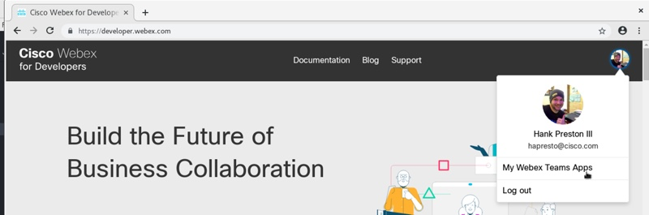
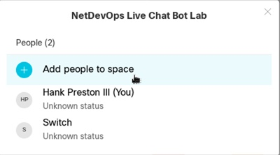
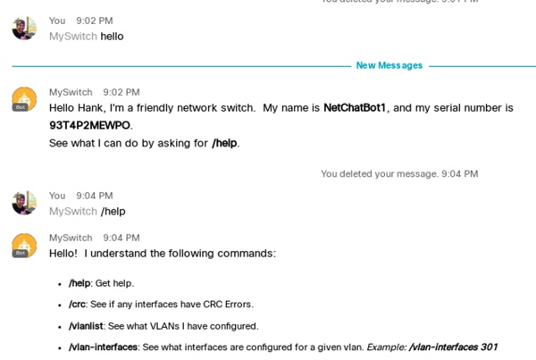

# Build a Network Management Chat Bot
Have you ever found yourself alone in the lab, talking to your router, and wishing it would talk back? In this session, you'll learn how you can make the dream a reality by building a Network Management Chatbot and deploying it to a network device. Through Webex Teams, you'll be able to inquire of your router what its uptime is, which interfaces are up, suggest configuration changes, or even just ask it if it like long walks on the beach. The options are really endless.

# Lab Preparation
If you haven't been assigned a lab pod by your instructor, or you're running this lab on your own, be sure to go reserve an [Open NX-OS on Nexus 9000 Sandbox](https://devnetsandbox.cisco.com/RM/Diagram/Index/0e22761d-f813-415d-a557-24fa0e17ab50?diagramType=Topology) from DevNet.  

### Connecting to your Pod and Getting the Code

1. Using your lab details, VPN into your pod.

1. RDP to the Developer Workstation (DevBox) in your lab.  The IP Address is `10.10.20.20` and the credentials are `developer / C1sco12345`.

    > This lab guide will assume all steps will be run from the DevBox.  If you've installed all the needed pre-req and tools locally on your own workstation, you could run the lab from there as well.  
    
1. Open a terminal on your DevBox, clone down the workshop repository into the `~/code` directory.  

    ```bash
    cd code
    git clone https://github.com/hpreston/workshops
    cd workshops
    ```

1. Change into the `netchatbot` directory, and open the code with the **Atom** IDE.  

    ```bash
    cd netchatbot
    ```

1. Create a Python 3.6 virtual environment and install the requirements that are included in the `requirements.txt` file.  

    ```bash
    python3.6 -m venv venv
    source venv/bin/activate
    pip install -r requirements.txt
    ```
    
    > The top level libraries being installed include `webexteamsbot`, `pyats`, `genie`, `ncclient`, `netmiko`, `requests`.  These are used to create the bot, or interact with the switch via different APIs. 

1. Open the code with the **Atom** IDE.  

    ```bash
    atom .
    ```

1. With Atom, open the `env_bot.template` file, and save a new copy as `env_bot`. 

    > You will be adding specific details and "secrets" for your bot to this file. 

### Creating a New Bot Account in Webex Teams
    
1. Open Chrome and navigate to [https://developer.webex.com](https://developer.webex.com) and login.  If you do NOT yet have a Webex Teams account, create one.  

1. Click on your image/avatar in the upper right corner and choose "My Webex Teams Apps"

    
    
1. Create a "New App" as a "Bot".  Fill in the form for your new bot.  You'll need to provide: 

    * **Bot Name** - Friendly Name 
    * **Bot Username** - must be unique, find something that passes. The domain `@webex.bot` will be added to the username.  
    * **Icon** - Pick one of the default icons. 
    * **Description** - Provide some short description. 

    > Click "Add Bot" at bottom of form. 
    
1. On the confirmation page, you'll see your **Bot's Access Token**.  This is the API token for your bot to communicate with Webex Teams and identify itself.  This is the ***only*** time this token is shown.  If you don't capture it now, you'll be able to regenerate a new token, but won't be able to retrieve this one.  

1. Copy the token, and paste it in the `env_bot` file in Atom for the `TEAMS_BOT_TOKEN` value.  

1. While in Atom, provide the `TEAMS_BOT_EMAIL` value.  This is your selected `username` + `@webex.bot`.  

1. In a new tab in Chrome, navigate to [https://teams.webex.com](https://teams.webex.com).  

    > Alternatively, if you have Webex Teams installed on your local workstation, feel free to use that client instead of the web client.  
    
1. If you are completing this lab as part of a proctored workshop, the instructor should have added you to a space with for the workshop.  Go ahead and add your newly created bot account to the space.  

    
    
    > If you are completing this lab independently, you can create your own space, or just use 1 on 1 messages with your bot.  
    
### Completing your `env_bot` Details 

1. Open a new tab in your terminal where you'll start and run `ngrok` to create the local tunnel to receive the web hooks from the cloud.  

1. `ngrok` is already installed on the DevBox, so in the new terminal enter the command `ngrok http 5000` to create the tunnel to send HTTP traffic to port 5000 on your workstation.  This is the port that your bot will run on.  

    ```bash
    # Sample Output
    ngrok by @inconshreveable                                       (Ctrl+C to quit)
                                                                                    
    Session Status                online                                            
    Session Expires               7 hours, 59 minutes                               
    Version                       2.2.8                                             
    Region                        United States (us)                                
    Web Interface                 http://127.0.0.1:4040                             
    Forwarding                    http://749e0b9b.ngrok.io -> localhost:5000        
    Forwarding                    https://749e0b9b.ngrok.io -> localhost:5000       
                                                                                    
    Connections                   ttl     opn     rt1     rt5     p50     p90       
                                  0       0       0.00    0.00    0.00    0.00      
    ```
    
1. Copy the `Forwarding` address that starts with `https`, and paste it into `env_bot` as the `TEAMS_BOT_URL`.  

    > The `http` address would also work, but let's use security! 
    
1. For the `TEAMS_BOT_APP_NAME`, give your bot a name.  If you have spaces in the name, be sure to surround it with quotes.  For example `TEAMS_BOT_APP_NAME="Network Management Chat Bot Workshop"`

1. Your `env_bot` file should look like this example now, but with the values for your own bot.  

    ```bash
    # Convenience file to set local environment variables for chat bot
    # Bot Details
    export TEAMS_BOT_EMAIL=myswitch@webex.bot
    export TEAMS_BOT_TOKEN=Y2YwMTI4ZjUtM2IyYi00MjhadsfiadsfaZmVlOGU5YzY3YmQzMjc5NWYtMThm
    export TEAMS_BOT_URL=https://749e0b9b.ngrok.io
    export TEAMS_BOT_APP_NAME="Network Management Chat Bot Workshop"
    
    # Managed Device Details
    export DEVICE_TYPE=cisco_nxos
    export DEVICE_ADDRESS=10.10.20.58
    export DEVICE_NETCONF_PORT=830
    export DEVICE_USERNAME=admin
    export DEVICE_PASSWORD=Cisco123
    
    export TESTBED_FILE="pyats-testbed.yaml"
    export TESTBED_DEVICE=NetChatBot1
    ```

1. Save the `env_bot` file.  

1. Leave the terminal tab with ngrok running, but return to the previous terminal tab where you had cloned the code down.  

1. Source the `env_bot` file to set environment variables for connecting to the switch and your bot information.  

    ```bash
    source env_bot
    ```

### Preparing your Lab Switch 
To have some more interesting details about our switch, we will install some basic configuration using an included baseline script and payload using NETCONF and ncclient.

1. Open a terminal on the DevBox and SSH to the Nexus 9000 switch in your lab.

    ```bash
    ssh admin@10.10.20.58
    
    # Password is Cisco123
    ```

1. Enable NETCONF and NX-API on the switch.  We will use NETCONF to push a baseline configuration to the switch.  *You will have the option to use NETCONF or NX-API in addition to SSH as APIs for interacting with the switch from your bot.*

    ```shell
    conf t
    feature netconf
    feature nxapi
    end
    copy run start
    ```

1. Disconnect from switch. 

1. Change to `setup` directory and run `load-n9k-baseline.py` script.

    ```bash
    cd setup
    python load-n9k-baseline.py
    
    # Expected output
    <?xml version="1.0" encoding="UTF-8"?>
    <rpc-reply message-id="urn:uuid:4c0563f1-1bae-46dc-a2d2-9db6eeefee29" xmlns="urn:ietf:params:xml:ns:netconf:base:1.0">
        <ok/>
    </rpc-reply>
    ```
    
    > You can confirm it worked by SSHing to your switch.  The hostname should now be `NetChatBot1` and there should be VLANs, interfaces, and routing configured.  

1. Change back to `netchatbot` directory.

    ```bash
    cd ..
    ```

# Exploring the Initial Chat Bot Code 
Included in the workshop code is a functioning ChatBot that we will use to understand the parts before adding a new command to the bot.  

## Starting the Sample Bot

1. From the terminal, execute the following command to start your bot.  

    ```bash
    python chatbot_example.py
    ```
    
    ```python
    # Example output
    Teams Bot Email: myswitch@webex.bot
    Teams Token: REDACTED
    Creating new webhook.
    Configuring Webhook. 
    Webhook ID: Y2lzY29zcGFyazovL3VzL1dFQkhPT0svOTQzNTk5ODYtZDAzMi00NWJiLTg0MmQtZWVkMWVhM2U3MWI4
     * Serving Flask app "Network Management Chat Bot Workshop" (lazy loading)
     * Environment: production
       WARNING: Do not use the development server in a production environment.
       Use a production WSGI server instead.
     * Debug mode: off
     * Running on http://0.0.0.0:5000/ (Press CTRL+C to quit)
    ```

1. From the Webex Teams client (either web within the devbox or locally), say "hello" to your bot.  Then ask for `/help` to see the commands that are supported.  

    > If you are using a Teams Space with multiple people and bots included, you'll need to `@your_bot` for the message.  This is because Webex Teams **ONLY** sends web hooks to bot accounts in group spaces when the account is mentioned.  In a 1 on 1 conversation with a bot, there is no need to mention the bot.  
    
    

1. Try some of the other commands listed to see how they work.  

1. If you watch the terminal where your bot is running, you'll see lots of log messages about the bot communications.  These are handy for debugging and understanding what is going on behind the scenes.  

## Sample Bot Code Walkthrough 
Now that you've seen the bot running, the instructor will walk through the code that makes the bot work.  

### `chatbot_example.py` 

### `library/system_info.py` 

### `library/netmiko_commands.py` 

# Add a New Command! 
Now that you understand the pieces that make up the bot, it's your turn to add a new command to the bot.  You have some options: 

* Use one of the provided pyATS functions and the data available in a new or different way 
* Create a new pyATS function using another Genie parser
* Use netmiko and CLI commands to construct a new function that does some task 
* Use NX-API or NETCONF to build a new `library` file 

## Suggestions 

1. Create a new local code branch to work in.  `git checkout -b newfeature` 
1. Use the provided code as templates for your own functions and work. 
1. Create and test the library function you'll be using in "interactive Python" to become familiar with the data being returned first. 
1. Break down your overall plan into small steps and test each step along the way. 


# Putting Bot in Docker
The final step in this lab is to move our application into a Docker image and run as a container.  

<!--1. Set an environment variable for your Docker Username (convenience).

```bash
export DOCKER_USERNAME={{YOUR DOCKER USERNAME}}
```
-->

1. In Atom, open the `Dockerfile` that is included in the repo.  This is the definition on how to build an image for the chat bot.  It installs all requirements and loads the code up.   

1. Build the Docker image file on your development workstation.

    ```bash
    docker build -t netchatbot:latest .
    ```

1. Running a container based on the newly created image.

    ```bash
    docker run --rm --name netchatbot \
      -e TEAMS_BOT_EMAIL=${TEAMS_BOT_EMAIL} \
      -e TEAMS_BOT_TOKEN=${TEAMS_BOT_TOKEN} \
      -e TEAMS_BOT_URL=${TEAMS_BOT_URL} \
      -e TEAMS_BOT_APP_NAME="${TEAMS_BOT_APP_NAME}" \
      -e TESTBED_FILE=${TESTBED_FILE} \
      -e TESTBED_DEVICE=${TESTBED_DEVICE} \
      -p 5000:5000 \
      -d \
      netchatbot:latest
    ```

1. Send your bot some commands and test it out.  

1. Monitoring the logs from the bot.

    ```bash
    docker logs -f netchatbot
    ```
    
    > Use `^c` to quit log view

1. Stopping the bot

    ```bash
    docker stop netchatbot
    ```

1. This is the same bot, just now it's been containerized.  

1. The next step would typically be to `push` the image up to a container registry where you could pull it down to run it in a more production grade environment, but that's for another lab :-) 

<!--1. Push the image up to Docker Hub (so we can get it on our switch)

```bash
docker login

docker push ${DOCKER_USERNAME}/netchatbot:latest
```-->

<!--# Docker on Nexus 9K Setup

## Enable Docker

1. From enable mode:

```shell
guestshell disable
```

1. From config mode:

```shell
feature bash-shell

vrf context management
  ip domain-name lab.intra
  no ip name-server 10.10.2.18 10.10.2.20 128.107.212.175
  ip name-server 208.67.222.222
```

1. Enter bash-shell and run:

```bash
run bash sudo su -

service docker start
service docker status
chkconfig --add docker
```

1. Increase size of Docker disk partition to support size of our bot.

```bash
df -kh /var/lib/docker
service docker stop
truncate -s +1300MB /bootflash/dockerpart
e2fsck -f /bootflash/dockerpart
/sbin/resize2fs /bootflash/dockerpart
service docker start
df -kh /var/lib/docker
```

## Pulling the docker image to the switch

1. Enter bash-shell and `docker pull` the pushed image. (must use management vrf)

```bash
run bash sudo su -

export DOCKER_USERNAME={{YOUR DOCKER USERNAME}}

ip netns exec management docker pull ${DOCKER_USERNAME}/netchatbot:latest

```

## Setting up local environment for bot

1.

```bash
# Fill in your bot details and paste into your switch
# Or just pull out of your 'env_bot' file
export TEAMS_BOT_EMAIL=
export TEAMS_BOT_TOKEN=
export TEAMS_BOT_URL=
export TEAMS_BOT_APP_NAME=""
export TESTBED_FILE="pyats-testbed-onbox.yaml"
export TESTBED_DEVICE=NetChatBot1
```


1. Run the bot.  `--network host` to allow incoming network traffic.

```bash
docker run --rm --name netchatbot \
  -e TEAMS_BOT_EMAIL=${TEAMS_BOT_EMAIL} \
  -e TEAMS_BOT_TOKEN=${TEAMS_BOT_TOKEN} \
  -e TEAMS_BOT_URL=${TEAMS_BOT_URL} \
  -e TEAMS_BOT_APP_NAME="${TEAMS_BOT_APP_NAME}" \
  -e TESTBED_FILE=${TESTBED_FILE} \
  -e TESTBED_DEVICE=${TESTBED_DEVICE} \
  -p 5000:5000 \
  -d \
  --network host \
  -v /var/run/netns:/var/run/netns:ro,rslave \
  --cap-add SYS_ADMIN \
  ${DOCKER_USERNAME}/netchatbot:latest
```
-->